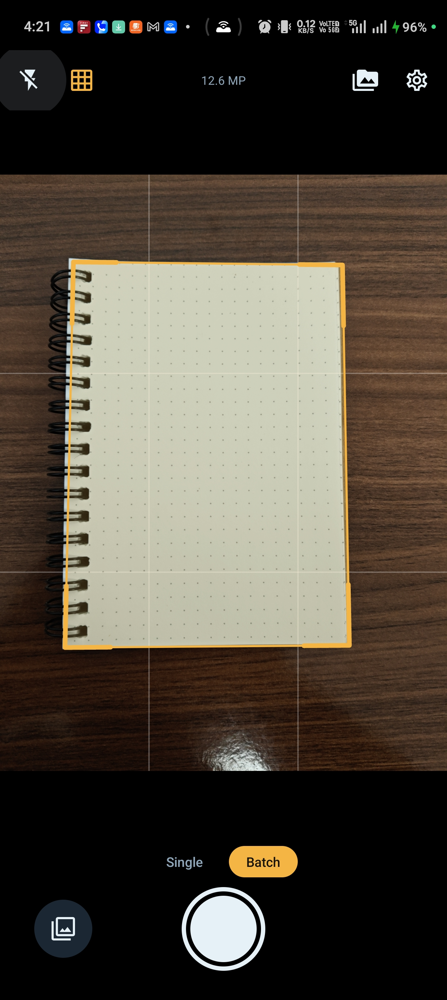
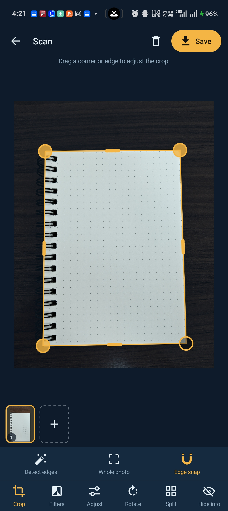
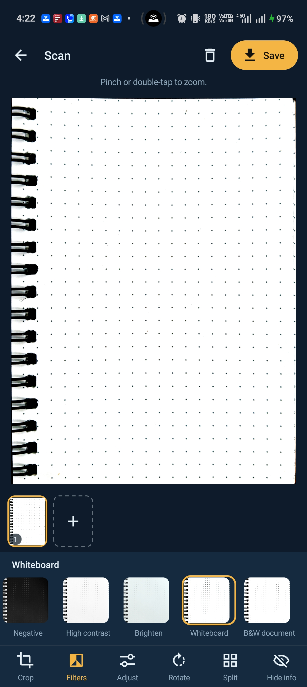
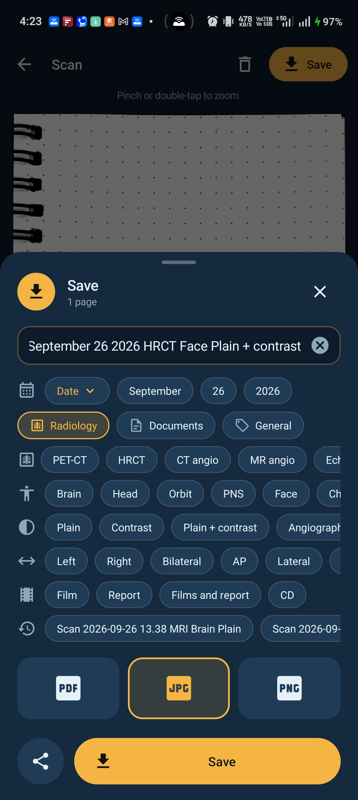

# RadioFilm Scanner

**A small, private, offline document scanner for Android, built around CT and MRI films.** Also available as **DocScanner** for everyday paperwork: same app, your choice of name and icon.

Photograph a film on a lightbox (or a report, a prescription, a whiteboard), and the app finds the edges, straightens the perspective, enhances it, and saves a clean full-resolution JPEG, PNG or PDF. No account, no cloud, no ads. The app does not even request internet access.

    

<p align="center">
  
  
  
  
</p>

## Why this exists

Microsoft Lens was the simple scanner many of us relied on for years. Microsoft retired it in 2026: it was pulled from the app stores on February 9, new scans stopped working after March 9, and users were pointed to OneDrive and the Microsoft 365 Copilot app instead.

RadioFilm Scanner is a replacement that does the one job well: a fast camera-to-file flow, strong edge detection on backlit films, filters made for X-ray and CT/MRI films, and files that stay on your phone.

## Two names, one app

| | **RadioFilm Scanner** | **DocScanner** |
|---|---|---|
| Best for | CT, MRI and X-ray films on a lightbox; radiology reports | Everyday paperwork: reports, prescriptions, bills, forms, notes, whiteboards |
| Name suggestions | Radiology: modality, body part, technique, side and view | Documents and General: document type, people and places, topics |
| Saves to | `Pictures/RadioFilm Scanner`, `Download/RadioFilm Scanner` | `Pictures/DocScanner`, `Download/DocScanner` |

Every feature is available in both. Switch any time in **Settings > Appearance > App name and icon**; it changes the name and icon on your home screen, the folders new files are saved in, and (optionally) the name suggestions. After switching, add the new icon from the app drawer if the old one disappears from your home screen. Android's own app settings keep listing the app as "RadioFilm Scanner".

## Features

### Capture
- **Full-resolution capture.** Uses the largest photo size the camera offers, including high-resolution modes, at JPEG quality 100 with high-quality noise reduction and sharpening.
- **Live edge detection** with an outline that glides smoothly with the page, plus optional **auto-capture** with a "HOLD STEADY" prompt and a ring that fills as the shot steadies.
- **Single or Batch mode.** Review each photo right away, or shoot a stack of films and review at the end.
- Tap to focus, flash off / auto / on / torch, framing grid.
- **Import** one or many photos from the gallery, or share images into the app from any other app.
- **Tablets** turn freely with a landscape camera layout, without restarting the camera; phones stay in portrait.

### Crop and edit (one full-screen editor)
- Opens in **crop mode** with the detected edges. Drag a corner or a whole edge; a magnifier shows the pixels under your finger, and handles **snap to the nearest film or paper edge**. Pinch to zoom, pan with two fingers, double-tap to zoom in or back to fit.
- **Perspective correction with true aspect ratio**, so results are not squashed.
- **Undo and redo** for every edit, **Reset** in each tool, and "Reset all edits" to return a page to the original photo. Editing is non-destructive: the original photo is never changed.
- **Thumbnail strip** to jump to any page, swipe between pages, **+** to add pages, and **Rearrange** (drag and drop) when there are two or more.
- **11 filters:** No effects, Auto, Pro color, Grayscale, **X-ray enhance**, **X-ray detail**, Negative, High contrast, Brighten, Whiteboard, B&W document. Brightness, contrast and sharpness, with **Apply to all** pages.
- Rotate, **split multi-slice films into panels** (up to 8 x 8, each saved as its own image), and duplicate a page to crop a second area.
- **Anonymise** patient details with a **black box**, **blur** or **pixelate** before sharing. Black box is the safest choice for names and IDs.

### Save and share
- **JPEG, PNG (lossless) or multi-page PDF**, always rendered from the full-resolution original, with a progress bar.
- The save sheet shows **where the files will go**, the **estimated size** and your **free space**, and warns before you run out.
- **Name suggestions** while saving and renaming: date pieces and styles, recent names, and customisable sets for radiology, documents and general use (including smart words such as weekday, page count and an automatic counter).
- Choose a preferred format in Settings, or be asked every time. Share directly from the same sheet.

### Saved scans
- Every saved batch is kept with a cover image: view it, share it again, rename it or delete it. Each shows where its files were saved.
- **Edit a saved scan in its own workspace.** Its pages are never mixed with other scans, and saving again updates that same scan.
- If the app is closed unexpectedly mid-scan, it offers to **resume or discard** the unfinished pages next time.

### Settings
- Save format, output size limit, JPEG quality, and where files go.
- File naming and fully customisable name suggestion sets.
- App name and icon (RadioFilm Scanner or DocScanner) and accent colour.
- **Export and import all settings** to a file.
- Camera: auto-capture, edge snap, grid, shutter sound, and a viewfinder rotation override for unusual devices.
- **Check for updates** (see below).

### Privacy
- No internet permission, no account, no analytics, no ads.
- Permissions: camera, plus storage on Android 9 and older (for saving to the gallery).
- Links in the app (source code, updates, donations) open in your browser; the app itself cannot connect to anything.

## Where your files are saved

| Format | Folder |
|---|---|
| JPEG and PNG images | `Pictures/RadioFilm Scanner` (or `Pictures/DocScanner`), visible in your Gallery |
| PDF documents | `Download/RadioFilm Scanner` (or `Download/DocScanner`), visible in your Files app |

The app also keeps its own copy of each saved scan (in **Saved scans**) so you can edit it again later.

## Install and update

1. Download the latest `RadioFilm-Scanner-v*.apk` from [Releases](../../releases).
2. Open it on your phone and allow "Install unknown apps" for your browser or file manager when asked.
3. If Play Protect warns about an unknown developer, choose **Install anyway**.

**Updating:** install the new APK over the old one; your saved scans and settings are kept. In the app, **Settings > Check for updates** shows your version and opens the latest release here, because the app has no internet access of its own.

Works on Android 5.0 and newer, on any processor (the APK contains no native code). After updating to 1.7.0, if the home-screen icon disappears, add it again from the app drawer.

## Support the project

- [Buy me a coffee](https://buymeacoffee.com/jemishmayani)
- Star the repository, and share it with colleagues who scan films or paperwork.
- [Report a problem or suggest a feature](../../issues/new).

## Build from source

The project uses no Gradle: a single script calls the Android SDK tools directly, which keeps the APK small.

**You need:**
- A JDK (17 or 21) with `javac` and `jar` on your PATH.
- The Android SDK with build-tools and one platform, for example:
  ```bash
  sdkmanager "build-tools;36.0.0" "platforms;android-36"
  ```
- Your signing key (see [docs/RELEASING.md](docs/RELEASING.md)).

**Build:**
```bash
cp signing.env.example signing.env   # then edit: key path, alias, passwords
./build.sh                           # -> dist/RadioFilm-Scanner-v<version>.apk
```
`build.sh` looks for the SDK in `ANDROID_HOME` (or `ANDROID_SDK_ROOT`). You can also set `BUILD_TOOLS` and `ANDROID_JAR` yourself. On Windows, run it from Git Bash or WSL.

Released APKs are compiled against the `android-23` platform library and target Android 16 (API 36); newer Android features are reached safely at run time.

## Tests

The image-processing core is plain Java and is tested on the desktop:

```bash
./test/run-tests.sh
```

It covers edge detection, corner and edge snapping, aspect-ratio estimation, filters, viewfinder orientation maths for phones and tablets, the anonymise effects, and a pixel-by-pixel check that the memory-saving strip renderer matches a single-piece render exactly.

## Project structure

```
AndroidManifest.xml
build.sh                     build + sign without Gradle
src/com/filmscan/core/       pure-Java imaging: edge detection, snapping, perspective,
                             filters, anonymise effects, PDF writer (desktop-testable)
src/com/filmscan/app/        Android app: camera, editor, rearrange, saved scans,
                             settings, name suggestions, export, about
res/                         vector icons, two launcher icons, themes, animations
test/                        desktop tests
docs/RELEASING.md            versioning and release checklist
CHANGELOG.md                 what changed in each version
```

## Versions

See [CHANGELOG.md](CHANGELOG.md) for the history and [docs/RELEASING.md](docs/RELEASING.md) for how versions are numbered and released.

## Disclaimer

RadioFilm Scanner is a scanning and sharing tool, **not a medical device**. Scans are for records and communication; make diagnostic decisions from the original films or the original digital images.

## Credits

Built by a neurosurgery resident, with Claude as coding partner. Icons: [Material Design Icons](https://pictogrammers.com/library/mdi/) by Pictogrammers, used under their free open-source license.

## License

See [LICENSE](LICENSE).
